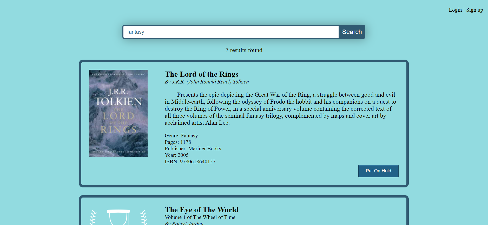

# Online Library System
> A library system for storing, searching, and managing books in my personal library. The project was started in June 2020 and is currently still in progress.
The ultimate goal is to host it on a virtual private server and register a domain name, both to demonstrate it working and so that myself and anybody I know
could check out books from my library. So far it has been an exciting learning experience on how to build a web application from scratch using the LAMP stack.
An emphasis has also been placed on security; to learn about potential vulnerabilities in the application and to try to secure it as much as possible. The code
is also meant to be self-documenting, readable, and clean. I'm passionate about writing maintainable and understandabe code, which should be reflected throughout the
project.
## Functionality
### Index Page

  

The homepage is a simple search bar that allows anybody to search for books that exist in the library. All
books are stored in a MySQL database and returned based on similarity between the query and title, subtitle, author, publisher, genre, series, summary, and ISBN.
There are also links to log in to an existing user account or to create a new account. When creating
a new account, all the user needs is their name, email, and a secure password. Input is verified: no duplicate
email addresses are allowed, the password must follow good security practices and be reentered, and a first name 
is required. The input is also sanitized, with tags being stripped to prevent cross-site scripting and prepared 
MySQL statements to prevent SQL-injections. The password is also hashed and stored in the database, so that in the
case of a breach no plaintext passwords are obtained.

### Search Results

  

When a search is performed, all existing books in the library are returned that are relevant to the query. There is a call to an API
specifically designated to return books in JSON format based on the query. Search results
are then created and displayed dynamically with AngularJS components. Each result includes a thumbail image of the cover, if available,
and a short summary, along with more specific details, such as ISBN, publisher, date, number of pages, and genre. If the book is currently
available (not checked out) then a check out button is displayed. If a user is logged in, they can check out the book and the button is
disabled, and if they are not logged in they are directed to the login page. If a book is checked out and the user is logged in,
they can also put the book on hold. Then when the book is checked in by a library administrator, it is checked out the the next person
on the list of holds. All checkout and hold transactions are stored in the database and are never deleted, in order to keep a record
of all transactions.

### Account Page

  

The account page is accessible to any user that is logged in and displays important account information. A normal user
can see every book that they have currently checked out or put on hold and their account details, and an administrator can also manage
the library by adding books, deleting books, updating books, and checking books in and out. The administrator page is a simple ISBN search box that first
searches the existing library and if the book is already stored it returns all the details associated with that book. The administrator can
then update the details, delete the book, or check the book back into the library. If the book doesn't exist in the library, it sends a 
call to the Google Books API with a query
for the given ISBN. The book API returns information about the associated book, if it exists in the database. The returned results are processed
and used to fill in the details of the book on the administrator page. The administrator then reviews the information, completes some library
specific fields, and then adds the book to the library.

## TODO:
* Implement API authentication to restrict access
* Send an account verification email when a user signs up
* Ensure session security to prevent session hijacking
* Add the ability for a user to change their password
* Add a "forgot password" option on login
* Update styling and fix minor bugs
